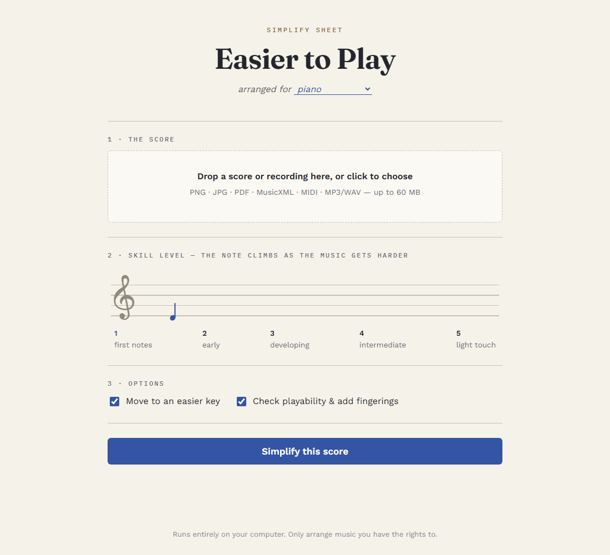

# ScaleBack

Turn sheet music — an **image, PDF, MusicXML, MIDI, or audio recording** — into an
**easier arrangement** for **guitar, piano, or clarinet**, tuned to a skill level from
1 (first notes) to 5 (light touch). Playability-checked, fingered, with guitar TAB,
and a local web app to practice against.



## Quick start

```bash
uv sync --extra web
uv run scaleback-web                        # web app → http://127.0.0.1:5757
uv run scaleback song.pdf -i guitar -l 2    # or the CLI
```

Reading scans/PDFs needs an OMR engine: install
[Audiveris](https://github.com/audiveris/audiveris/releases) and put it on PATH
(recommended — auto-detected), or `uv sync --extra omr` for the slower built-in
fallback. Audio input: `uv sync --extra audio`. Tests: `uv run pytest -q`.

## What it does

- **Simplifies**: keeps the melody, tames rhythms, moves to an easier key — five
  levels, from "quarter notes in C" to "just thin the chords".
- **Checks playability** per instrument — guitar chord shapes and fret positions,
  piano hand spans and fingerings, clarinet break crossings — and reports every
  adjustment it makes.
- **Guitar TAB**, generated from the computed string/fret choices.
- **Web app**: original and simplified side by side, one-tap note fixes, a practice
  player (tempo 40–140%, bar looping), and microphone play-along that scores your
  pitch and timing note by note.

## Good to know

- **OMR is the weak link.** Recognition errors happen on any real scan — eyeball the
  side-by-side view and use Fix Notes. Handwritten music won't work.
- The mic game is monophonic (piano: melody top line only); wear headphones.
- Runs fully offline except one CDN fetch for the score preview renderer.
- Only arrange music you have the rights to.

Full documentation — level definitions, the playability engines, inputs and OMR
engines, library usage, limitations: **[docs/DETAILS.md](docs/DETAILS.md)**
